# Smart Laptop Advisor Admin Platform

## Overview

The Smart Laptop Advisor Admin Platform is a comprehensive web-based administration system designed to manage a laptop recommendation platform powered by AI technology. This platform provides administrators with tools to manage products, orders, customers, AI recommendations, chatbot interactions, and generate detailed analytics reports.

## Features

### 🏪 E-commerce & Operations Management
- **Product Management**: Add, edit, and manage laptop inventory with detailed specifications
- **Order Management**: Track and process customer orders with real-time status updates
- **Inventory Control**: Monitor stock levels and manage product availability
- **Transaction Management**: Handle payment processing and financial transactions

### 🤖 AI Recommendation Engine
- **Persona Management**: Define and manage customer personas for targeted recommendations
- **AI Weightage Configuration**: Fine-tune recommendation algorithms and parameters
- **Recommendation Logs**: Track AI-generated recommendations and their performance
- **Performance Analytics**: Monitor AI system accuracy and optimization metrics

### 💬 Chatbot Management
- **Conversation Logs**: Review and analyze customer chatbot interactions
- **Intent Management**: Manage chatbot intents and response patterns
- **Training Management**: Train and improve chatbot models with new data
- **Analytics Dashboard**: Monitor chatbot performance and user satisfaction

### 👥 User & System Administration
- **Customer Management**: Manage customer accounts and profiles
- **Admin Management**: Control administrator accounts and permissions
- **Role Management**: Define roles and access permissions
- **System Settings**: Configure platform-wide settings and preferences

### 📊 Reports & Analytics
- **Comprehensive Reports**: Generate detailed business intelligence reports
- **System Logs**: Monitor system activities and troubleshoot issues
- **Real-time Analytics**: Track key performance indicators and metrics

## Technology Stack

- **Frontend**: HTML5, CSS3, Bootstrap 5, JavaScript
- **Charts & Visualization**: ApexCharts
- **Icons**: Bootstrap Icons, Iconly
- **Build Tools**: Webpack Mix
- **Package Management**: npm/yarn

## Demo Credentials

The platform includes demo credentials for testing:

### Super Admin
- **Email**: admin@smartlaptop.com
- **Password**: password123

### Product Manager
- **Email**: manager@smartlaptop.com
- **Password**: manager123

## Project Structure

```
mazer-1.0.0/
├── dist/                          # Production build files
│   ├── admin-*.html              # Admin panel pages
│   │   ├── admin-dashboard.html  # Main dashboard
│   │   ├── admin-products.html   # Product management
│   │   ├── admin-orders.html     # Order management
│   │   ├── admin-customers.html  # Customer management
│   │   ├── admin-admins.html     # Admin user management
│   │   ├── admin-roles.html      # Role & permissions
│   │   ├── admin-personas.html   # AI persona management
│   │   ├── admin-ai-*.html       # AI system pages
│   │   ├── admin-chatbot-*.html  # Chatbot management
│   │   ├── admin-reports.html    # Analytics & reports
│   │   └── admin-logs.html       # System logs
│   └── assets/                   # Static assets
│       ├── css/                  # Stylesheets
│       ├── js/                   # JavaScript files
│       ├── images/               # Images and icons
│       └── vendors/              # Third-party libraries
├── src/                          # Source files
│   ├── scss/                     # SASS source files
│   └── js/                       # JavaScript source files
├── package.json                  # Node.js dependencies
├── webpack.mix.js               # Build configuration
├── yarn.lock                    # Yarn lock file
└── README.md                    # This file
```

## Installation & Setup

### Prerequisites
- Node.js (v14 or higher)
- npm or yarn package manager
- Modern web browser

### Installation Steps

1. **Clone the repository**
   ```bash
   git clone <repository-url>
   cd mazer-1.0.0
   ```

2. **Install dependencies**
   ```bash
   npm install
   # or using yarn
   yarn install
   ```

3. **Build the project**
   ```bash
   # Development build
   npm run dev
   
   # Production build
   npm run production
   
   # Watch for changes (development)
   npm run watch
   ```

4. **Serve the application**
```bash
   # Option 1: Open directly in browser
   open dist/admin-login.html
   
   # Option 2: Use a local server
   npx serve dist
   # or
   python -m http.server 8000 --directory dist
   ```

5. **Access the application**
   - Navigate to the login page
   - Use the demo credentials provided above
   - Explore the various admin modules

## 4.1.2 Detailed Use Case Diagrams

The following use case diagrams illustrate the detailed interactions between administrators and the four main functional modules of the Smart Laptop Advisor Admin Platform. These diagrams provide a comprehensive view of the system's functionality and the relationships between different use cases.

### Figure 4.1: Use Case Diagram of User and System Administration Module

```mermaid
graph TB
    subgraph "User and System Administration Module"
        Admin((Admin))
        
        subgraph "Customer Management"
            UC1[Manage Customer Accounts]
            UC2[View Customer Profile]
            UC3[Update Customer Status]
            UC4[Export Customer Data]
        end
        
        subgraph "Admin Management"
            UC5[Manage Admin Accounts]
            UC6[Create Admin User]
            UC7[Update Admin Profile]
            UC8[Reset Admin Password]
            UC9[Suspend Admin Account]
        end
        
        subgraph "System Configuration"
            UC10[Configure System Settings]
            UC11[Manage Security Settings]
            UC12[Update System Parameters]
            UC13[Backup System Data]
        end
        
        Admin --> UC1
        Admin --> UC2
        Admin --> UC3
        Admin --> UC4
        Admin --> UC5
        Admin --> UC6
        Admin --> UC7
        Admin --> UC8
        Admin --> UC9
        Admin --> UC10
        Admin --> UC11
        Admin --> UC12
        Admin --> UC13
        
        UC1 -.-> UC2 : <<include>>
        UC1 -.-> UC3 : <<include>>
        UC5 -.-> UC6 : <<include>>
        UC5 -.-> UC7 : <<include>>
        UC10 -.-> UC11 : <<include>>
        UC10 -.-> UC12 : <<include>>
    end
    
    classDef actor fill:#e1f5fe,stroke:#01579b,stroke-width:2px,color:#000
    classDef usecase fill:#f3e5f5,stroke:#4a148c,stroke-width:2px,color:#000
    classDef module fill:#e8f5e8,stroke:#2e7d32,stroke-width:3px,color:#000
    
    class Admin actor
    class UC1,UC2,UC3,UC4,UC5,UC6,UC7,UC8,UC9,UC10,UC11,UC12,UC13 usecase
```

### Figure 4.2: Use Case Diagram of E-commerce and Operations Management Module

```mermaid
graph TB
    subgraph "E-commerce and Operations Management Module"
        Admin((Admin))
        
        subgraph "Product Management"
            UC1[Create Product]
            UC2[Update Product]
            UC3[Delete Product]
            UC4[View Product List]
            UC5[Bulk Upload Products]
            UC6[Manage Product Categories]
        end
        
        subgraph "Order Management"
            UC7[View Order List]
            UC8[Update Order Status]
            UC9[Process Order Cancellation]
            UC10[Generate Order Reports]
            UC11[Track Order Shipment]
        end
        
        subgraph "Inventory Management"
            UC12[Monitor Stock Levels]
            UC13[Update Inventory]
            UC14[Set Low Stock Alerts]
            UC15[Generate Inventory Reports]
        end
        
        subgraph "Transaction Management"
            UC16[View Transaction History]
            UC17[Process Refund]
            UC18[Generate Financial Reports]
            UC19[Reconcile Payments]
        end
        
        Admin --> UC1
        Admin --> UC2
        Admin --> UC3
        Admin --> UC4
        Admin --> UC5
        Admin --> UC6
        Admin --> UC7
        Admin --> UC8
        Admin --> UC9
        Admin --> UC10
        Admin --> UC11
        Admin --> UC12
        Admin --> UC13
        Admin --> UC14
        Admin --> UC15
        Admin --> UC16
        Admin --> UC17
        Admin --> UC18
        Admin --> UC19
        
        UC2 -.-> UC4 : <<include>>
        UC3 -.-> UC4 : <<include>>
        UC7 -.-> UC8 : <<include>>
        UC16 -.-> UC17 : <<extend>>
        UC12 -.-> UC14 : <<extend>>
    end
    
    classDef actor fill:#e1f5fe,stroke:#01579b,stroke-width:2px,color:#000
    classDef usecase fill:#f3e5f5,stroke:#4a148c,stroke-width:2px,color:#000
    classDef module fill:#e8f5e8,stroke:#2e7d32,stroke-width:3px,color:#000
    
    class Admin actor
    class UC1,UC2,UC3,UC4,UC5,UC6,UC7,UC8,UC9,UC10,UC11,UC12,UC13,UC14,UC15,UC16,UC17,UC18,UC19 usecase
```

### Figure 4.3: Use Case Diagram of AI Recommendation Engine Module

```mermaid
graph TB
    subgraph "AI Recommendation Engine Module"
        Admin((Admin))
        AISystem((AI System))
        
        subgraph "Persona Management"
            UC1[Create Customer Persona]
            UC2[Update Persona Attributes]
            UC3[Delete Persona]
            UC4[Analyze Persona Performance]
        end
        
        subgraph "AI Configuration"
            UC5[Configure AI Weightage]
            UC6[Train AI Model]
            UC7[Deploy AI Model]
            UC8[Monitor AI Performance]
            UC9[Optimize Algorithms]
        end
        
        subgraph "Recommendation Analytics"
            UC10[View Recommendation Logs]
            UC11[Analyze Conversion Rates]
            UC12[Generate AI Performance Report]
            UC13[Track Model Accuracy]
        end
        
        subgraph "Model Management"
            UC14[Version Control Models]
            UC15[A/B Test Models]
            UC16[Rollback Model Version]
            UC17[Export Model Data]
        end
        
        Admin --> UC1
        Admin --> UC2
        Admin --> UC3
        Admin --> UC4
        Admin --> UC5
        Admin --> UC6
        Admin --> UC7
        Admin --> UC8
        Admin --> UC9
        Admin --> UC10
        Admin --> UC11
        Admin --> UC12
        Admin --> UC13
        Admin --> UC14
        Admin --> UC15
        Admin --> UC16
        Admin --> UC17
        
        AISystem --> UC8
        AISystem --> UC11
        AISystem --> UC13
        
        UC6 -.-> UC7 : <<include>>
        UC8 -.-> UC12 : <<include>>
        UC15 -.-> UC16 : <<extend>>
        UC14 -.-> UC17 : <<extend>>
    end
    
    classDef actor fill:#e1f5fe,stroke:#01579b,stroke-width:2px,color:#000
    classDef usecase fill:#f3e5f5,stroke:#4a148c,stroke-width:2px,color:#000
    classDef module fill:#e8f5e8,stroke:#2e7d32,stroke-width:3px,color:#000
    
    class Admin,AISystem actor
    class UC1,UC2,UC3,UC4,UC5,UC6,UC7,UC8,UC9,UC10,UC11,UC12,UC13,UC14,UC15,UC16,UC17 usecase
```

### Figure 4.4: Use Case Diagram of Chatbot Management Module

```mermaid
graph TB
    subgraph "Chatbot Management Module"
        Admin((Admin))
        ChatbotSystem((Chatbot System))
        
        subgraph "Conversation Management"
            UC1[View Conversation Logs]
            UC2[Analyze Chat Sessions]
            UC3[Export Chat Data]
            UC4[Monitor Chat Quality]
        end
        
        subgraph "Intent Management"
            UC5[Create Chat Intent]
            UC6[Update Intent Responses]
            UC7[Delete Intent]
            UC8[Test Intent Recognition]
        end
        
        subgraph "Training Management"
            UC9[Upload Training Data]
            UC10[Train Chatbot Model]
            UC11[Validate Model Performance]
            UC12[Deploy Trained Model]
        end
        
        subgraph "Analytics & Reporting"
            UC13[Generate Chatbot Analytics]
            UC14[Track User Satisfaction]
            UC15[Monitor Response Accuracy]
            UC16[Create Performance Reports]
        end
        
        Admin --> UC1
        Admin --> UC2
        Admin --> UC3
        Admin --> UC4
        Admin --> UC5
        Admin --> UC6
        Admin --> UC7
        Admin --> UC8
        Admin --> UC9
        Admin --> UC10
        Admin --> UC11
        Admin --> UC12
        Admin --> UC13
        Admin --> UC14
        Admin --> UC15
        Admin --> UC16
        
        ChatbotSystem --> UC4
        ChatbotSystem --> UC11
        ChatbotSystem --> UC14
        ChatbotSystem --> UC15
        
        UC10 -.-> UC11 : <<include>>
        UC11 -.-> UC12 : <<include>>
        UC13 -.-> UC14 : <<include>>
        UC13 -.-> UC15 : <<include>>
        UC2 -.-> UC3 : <<extend>>
    end
    
    classDef actor fill:#e1f5fe,stroke:#01579b,stroke-width:2px,color:#000
    classDef usecase fill:#f3e5f5,stroke:#4a148c,stroke-width:2px,color:#000
    classDef module fill:#e8f5e8,stroke:#2e7d32,stroke-width:3px,color:#000
    
    class Admin,ChatbotSystem actor
    class UC1,UC2,UC3,UC4,UC5,UC6,UC7,UC8,UC9,UC10,UC11,UC12,UC13,UC14,UC15,UC16 usecase
```

### Figure 4.5: Use Case Diagram of Analytics & Reporting Module

```mermaid
graph TB
    subgraph "Analytics & Reporting Module"
        Admin((Admin))
        ReportingSystem((Reporting System))
        
        subgraph "Dashboard Analytics"
            UC1[View Analytics Dashboard]
            UC2[Customize Dashboard Widgets]
            UC3[Monitor Real-time Metrics]
            UC4[Set Performance Alerts]
        end
        
        subgraph "Sales Reporting"
            UC5[Generate Sales Report]
            UC6[Analyze Revenue Trends]
            UC7[Track Product Performance]
            UC8[Export Sales Data]
        end
        
        subgraph "AI Performance Reporting"
            UC9[Generate AI Performance Report]
            UC10[Analyze Recommendation Accuracy]
            UC11[Track Model Effectiveness]
            UC12[Compare Model Versions]
        end
        
        subgraph "System Analytics"
            UC13[Monitor System Performance]
            UC14[Analyze User Behavior]
            UC15[Generate System Health Reports]
            UC16[Track Resource Usage]
        end
        
        Admin --> UC1
        Admin --> UC2
        Admin --> UC3
        Admin --> UC4
        Admin --> UC5
        Admin --> UC6
        Admin --> UC7
        Admin --> UC8
        Admin --> UC9
        Admin --> UC10
        Admin --> UC11
        Admin --> UC12
        Admin --> UC13
        Admin --> UC14
        Admin --> UC15
        Admin --> UC16
        
        ReportingSystem --> UC3
        ReportingSystem --> UC13
        ReportingSystem --> UC16
        
        UC5 -.-> UC8 : <<extend>>
        UC9 -.-> UC12 : <<extend>>
        UC1 -.-> UC3 : <<include>>
        UC15 -.-> UC16 : <<include>>
    end
    
    classDef actor fill:#e1f5fe,stroke:#01579b,stroke-width:2px,color:#000
    classDef usecase fill:#f3e5f5,stroke:#4a148c,stroke-width:2px,color:#000
    classDef module fill:#e8f5e8,stroke:#2e7d32,stroke-width:3px,color:#000
    
    class Admin,ReportingSystem actor
    class UC1,UC2,UC3,UC4,UC5,UC6,UC7,UC8,UC9,UC10,UC11,UC12,UC13,UC14,UC15,UC16 usecase
```

### Use Case Descriptions

#### 4.1.2.1 User and System Administration Module

This module manages user accounts, permissions, and system configuration. Key use cases include:

- **Manage Customer Accounts**: Create, update, and maintain customer profiles
- **Manage Admin Accounts**: Control administrator access and permissions
- **Configure System Settings**: Set up system-wide parameters and security settings

#### 4.1.2.2 E-commerce and Operations Management Module

This module handles the core business operations including product catalog, orders, and inventory:

- **Product Management**: Complete CRUD operations for laptop inventory
- **Order Management**: Process and track customer orders through fulfillment
- **Transaction Management**: Handle payments, refunds, and financial reconciliation

#### 4.1.2.3 AI Recommendation Engine Module

This module manages the AI-powered recommendation system:

- **Persona Management**: Define customer segments for targeted recommendations
- **AI Configuration**: Train and deploy machine learning models
- **Performance Analytics**: Monitor AI effectiveness and accuracy

#### 4.1.2.4 Chatbot Management Module

This module controls the intelligent chatbot system:

- **Conversation Management**: Monitor and analyze customer interactions
- **Intent Management**: Define and maintain chatbot understanding capabilities
- **Training Management**: Improve chatbot responses through machine learning

#### 4.1.2.5 Analytics & Reporting Module

This module provides comprehensive business intelligence:

- **Dashboard Analytics**: Real-time system and business metrics
- **Sales Reporting**: Revenue analysis and product performance tracking
- **AI Performance Reporting**: Machine learning model effectiveness analysis

## Data Design & Entity-Relationship Diagram

The data design is a critical component of the system architecture, defining the structure, relationships, and constraints of all data managed by the Smart Laptop Advisor Admin Platform. A well-designed database schema is essential for ensuring data integrity, consistency, and efficient retrieval, which are fundamental to the platform's performance and scalability.

## 4.3.2 Class Diagram

The class diagram represents the object-oriented design of the Smart Laptop Advisor Admin Platform, showing the classes, their attributes, methods, and relationships. This diagram illustrates the system's architecture from a software design perspective, complementing the database schema with the business logic layer.

### System Architecture - Class Diagram

```plantuml
@startuml
title Class Diagram for Smart Laptop Advisor Admin Platform

skinparam classAttributeIconSize 0

' Core Authentication & Authorization Classes
abstract class User {
    +int id
    +string firstName
    +string lastName
    +string email
    +string passwordHash
    +DateTime createdAt
    +DateTime updatedAt
    +DateTime lastLogin
    +UserStatus status
    --
    +authenticate(email, password) : bool
    +updateProfile(data) : void
    +changePassword(oldPassword, newPassword) : bool
    +isActive() : bool
    +getFullName() : string
}

class Admin {
    +int adminId
    +string profileImage
    +Role role
    --
    +login(credentials) : AuthToken
    +logout() : void
    +hasPermission(permission) : bool
    +getAccessLevel() : string
    +manageUsers() : void
    +generateReports() : Report[]
    +viewSystemLogs() : SystemLog[]
}

class Customer {
    +int customerId
    +string phone
    +Persona persona
    +json preferences
    +json notificationSettings
    +json privacySettings
    +boolean marketingConsent
    +string profileImage
    +Date dateOfBirth
    +string address
    --
    +getRecommendations() : AIRecommendation[] [C]
    +updatePreferences(preferences) : void [C]
    +getOrderHistory() : Order[] [C]
    +startChatSession() : ChatbotConversation [C]
    +getPersona() : Persona [C]
    +updateProfile(data) : void [C]
    +getShoppingCart() : ShoppingCart [C]
    +getWishlist() : Wishlist [C]
    +submitProductReview(productId, rating, text) : ProductReview [C]
}

class Role {
    +int roleId
    +string roleName
    +string description
    +json permissions
    +RoleStatus status
    +DateTime createdAt
    +DateTime updatedAt
    --
    +hasPermission(permission) : bool
    +getPermissions() : string[]
    +assignToUser(user) : void
    +updatePermissions(permissions) : void
}

' E-commerce & Product Management Classes
class Product {
    +int productId
    +string productName
    +string brand
    +string model
    +string description
    +decimal price
    +int stockQuantity
    +string sku
    +json specifications
    +ProductCategory category
    +string imageUrl
    +ProductStatus status
    +Admin createdBy
    +DateTime createdAt
    +DateTime updatedAt
    +decimal averageRating
    +int reviewCount
    +int popularityScore
    +int viewCount
    +json seoMetadata
    --
    +updateStock(quantity) : void [A]
    +isInStock() : bool [CA]
    +getSpecifications() : json [CA]
    +updatePrice(newPrice) : void [A]
    +getInventoryLogs() : InventoryLog[] [A]
    +generateProductReport() : ProductReport [A]
    +getReviews() : ProductReview[] [CA]
    +calculateAverageRating() : decimal [CA]
    +incrementViewCount() : void [C]
    +getDetailedView() : json [C]
}

class ProductCategory {
    +int categoryId
    +string categoryName
    +string description
    +string icon
    +CategoryStatus status
    +DateTime createdAt
    --
    +getProducts() : Product[]
    +getProductCount() : int
    +updateCategory(data) : void
}

class InventoryLog {
    +int logId
    +Product product
    +int previousQuantity
    +int newQuantity
    +int changeAmount
    +string changeType
    +string reason
    +Admin admin
    +DateTime createdAt
    --
    +calculateChange() : int
    +getChangeDescription() : string
}

class Order {
    +int orderId
    +string orderNumber
    +Customer customer
    +decimal totalAmount
    +decimal taxAmount
    +decimal shippingAmount
    +OrderStatus orderStatus
    +PaymentStatus paymentStatus
    +string shippingAddress
    +string billingAddress
    +DateTime orderDate
    +DateTime shippedDate
    +DateTime deliveredDate
    +string trackingNumber
    +json orderMetadata
    +boolean isAiRecommended
    +OrderItem[] orderItems
    +Transaction[] transactions
    --
    +updateStatus(status) : void
    +calculateTotal() : decimal
    +addItem(product, quantity) : void
    +removeItem(itemId) : void
    +processPayment() : Transaction
    +generateInvoice() : Invoice
    +getTrackingInfo() : TrackingInfo
}

class OrderItem {
    +int orderItemId
    +Order order
    +Product product
    +int quantity
    +decimal unitPrice
    +decimal totalPrice
    +json productSnapshot
    --
    +calculateItemTotal() : decimal
    +updateQuantity(quantity) : void
}

class Transaction {
    +int transactionId
    +Order order
    +string transactionNumber
    +decimal amount
    +TransactionType transactionType
    +PaymentMethod paymentMethod
    +TransactionStatus transactionStatus
    +string gatewayResponse
    +DateTime processedAt
    +DateTime createdAt
    --
    +processPayment() : bool
    +refund(amount) : Transaction
    +getPaymentDetails() : PaymentDetails
}

' AI Recommendation Engine Classes
class AIRecommendationEngine {
    +string modelVersion
    +decimal accuracyScore
    +json configParameters
    --
    +generateRecommendations(customer, context) : AIRecommendation[]
    +trainModel(trainingData) : TrainingResult
    +evaluatePerformance() : PerformanceMetrics
    +updateWeightage(persona, weightage) : void
    +getModelMetrics() : ModelMetrics
    +deployModel(modelVersion) : void
}

class Persona {
    +int personaId
    +string personaName
    +string description
    +json characteristics
    +json preferences
    +json weightageConfig
    +PersonaStatus status
    +Admin createdBy
    +DateTime createdAt
    +DateTime updatedAt
    --
    +generateRecommendations(customer) : AIRecommendation[]
    +updateCharacteristics(characteristics) : void
    +getCustomers() : Customer[]
    +analyzePerformance() : PersonaAnalytics
}

class AIRecommendation {
    +int recommendationId
    +Customer customer
    +Persona persona
    +json recommendedProducts
    +decimal confidenceScore
    +json recommendationData
    +RecommendationStatus status
    +DateTime createdAt
    +boolean wasClicked
    +boolean resultedInPurchase
    --
    +trackClick() : void
    +trackPurchase() : void
    +getPerformanceMetrics() : RecommendationMetrics
    +updateStatus(status) : void
}

class AIPerformanceLog {
    +int logId
    +string modelVersion
    +decimal accuracyScore
    +decimal responseTime
    +int totalRecommendations
    +int successfulRecommendations
    +Date performanceDate
    +json metricsData
    +DateTime createdAt
    --
    +calculateSuccessRate() : decimal
    +generatePerformanceReport() : PerformanceReport
}

' Chatbot Management Classes
class ChatbotEngine {
    +string engineVersion
    +decimal accuracyRate
    +json configuration
    --
    +processMessage(message, context) : ChatbotResponse
    +trainModel(trainingData) : TrainingResult
    +classifyIntent(message) : Intent
    +generateResponse(intent, context) : string
    +updateConfiguration(config) : void
    +getAnalytics() : ChatbotAnalytics
}

class ChatbotConversation {
    +int conversationId
    +Customer customer
    +string sessionId
    +DateTime startedAt
    +DateTime endedAt
    +ConversationStatus conversationStatus
    +decimal satisfactionRating
    +json conversationMetadata
    +ChatbotMessage[] messages
    --
    +addMessage(message) : void
    +endConversation() : void
    +rateSatisfaction(rating) : void
    +getConversationSummary() : ConversationSummary
    +exportConversation() : string
}

class ChatbotMessage {
    +int messageId
    +ChatbotConversation conversation
    +MessageType messageType
    +string messageContent
    +json intentData
    +decimal confidenceScore
    +DateTime sentAt
    +boolean isFromBot
    +Intent classifiedIntent
    --
    +processMessage() : void
    +getIntentClassification() : Intent
}

class ChatbotIntent {
    +int intentId
    +string intentName
    +string description
    +json trainingPhrases
    +json responses
    +IntentStatus status
    +Admin createdBy
    +DateTime createdAt
    +DateTime updatedAt
    --
    +addTrainingPhrase(phrase) : void
    +addResponse(response) : void
    +updateStatus(status) : void
    +getMatchingMessages() : ChatbotMessage[]
    +train() : void
}

class ChatbotTrainingData {
    +int trainingId
    +string sessionName
    +int dataPointsCount
    +decimal accuracyAchieved
    +string modelVersion
    +TrainingStatus trainingStatus
    +DateTime startedAt
    +DateTime completedAt
    +json trainingConfig
    +Admin initiatedBy
    --
    +startTraining() : void
    +monitorProgress() : TrainingProgress
    +completeTraining() : TrainingResult
    +exportModel() : ModelFile
}

' Client-Side E-commerce Classes
class ShoppingCart {
    +int cartId
    +int customerId
    +Customer customer
    +CartItem[] items
    +decimal totalAmount
    +CartStatus status
    +DateTime createdAt
    +DateTime updatedAt
    --
    +addItem(product, quantity) : void [C]
    +removeItem(productId) : void [C]
    +updateQuantity(productId, quantity) : void [C]
    +calculateTotal() : decimal [C]
    +convertToOrder() : Order [C]
    +clearCart() : void [C]
    +getItemCount() : int [C]
    +isEmpty() : bool [C]
}

class CartItem {
    +int cartItemId
    +int cartId
    +int productId
    +Product product
    +int quantity
    +decimal unitPrice
    +DateTime addedAt
    --
    +calculateItemTotal() : decimal [C]
    +updateQuantity(quantity) : void [C]
    +isValidQuantity(quantity) : bool [C]
}

class Wishlist {
    +int wishlistId
    +int customerId
    +Customer customer
    +Product[] products
    +DateTime createdAt
    --
    +addProduct(productId) : void [C]
    +removeProduct(productId) : void [C]
    +moveToCart(productId) : void [C]
    +getProductCount() : int [C]
    +isProductInWishlist(productId) : bool [C]
    +shareWishlist() : string [C]
}

class ProductReview {
    +int reviewId
    +int customerId
    +int productId
    +Customer customer
    +Product product
    +int rating
    +string reviewText
    +boolean isVerifiedPurchase
    +int helpfulnessScore
    +ReviewStatus status
    +DateTime createdAt
    --
    +submitReview() : void [C]
    +updateReview(rating, text) : void [C]
    +markHelpful() : void [C]
    +reportReview() : void [C]
    +isValidRating(rating) : bool [C]
    +moderateReview() : void [A]
}

class UserSession {
    +string sessionId
    +int customerId
    +Customer customer
    +string sessionToken
    +DateTime expiresAt
    +json deviceInfo
    +string ipAddress
    +SessionStatus status
    +DateTime createdAt
    --
    +createSession() : string [C]
    +validateSession() : bool [CA]
    +refreshSession() : void [C]
    +expireSession() : void [CA]
    +isExpired() : bool [CA]
    +getSessionInfo() : json [A]
}

' System Management Classes
class SystemLog {
    +int logId
    +LogLevel logLevel
    +string category
    +string message
    +json logData
    +string userIp
    +Admin admin
    +DateTime createdAt
    --
    +formatLogEntry() : string [A]
    +filterLogs(criteria) : SystemLog[] [A]
    +exportLogs(format) : string [A]
}

class Report {
    +int reportId
    +string reportName
    +string reportType
    +json reportParameters
    +string filePath
    +ReportStatus reportStatus
    +Admin generatedBy
    +DateTime generatedAt
    +DateTime expiresAt
    --
    +generateReport() : void
    +exportReport(format) : string
    +scheduleReport(schedule) : void
    +getReportData() : json
}

class SystemSettings {
    +json generalSettings
    +json aiConfiguration
    +json chatbotSettings
    +json securitySettings
    +json notificationSettings
    --
    +updateSettings(category, settings) : void
    +getSettings(category) : json
    +resetToDefaults(category) : void
    +validateSettings(settings) : bool
    +backupSettings() : string
    +restoreSettings(backup) : void
}

' Service Layer Classes
class AuthenticationService {
    +authenticateUser(credentials) : AuthToken
    +validateToken(token) : bool
    +refreshToken(token) : AuthToken
    +logout(token) : void
    +resetPassword(email) : void
    +changePassword(userId, oldPassword, newPassword) : bool
}

class ProductService {
    +getProducts(filters) : Product[] [CA]
    +getProduct(id) : Product [CA]
    +createProduct(productData) : Product [A]
    +updateProduct(id, data) : Product [A]
    +deleteProduct(id) : bool [A]
    +updateInventory(id, quantity) : void [A]
    +searchProducts(query) : Product[] [CA]
    +getBrowseableProducts() : Product[] [C]
    +getProductDetails(productId) : Product [C]
    +getProductComparisons(productIds) : Product[] [C]
    +getFeaturedProducts() : Product[] [C]
    +getRelatedProducts(productId) : Product[] [C]
    +trackProductView(productId) : void [C]
}

class OrderService {
    +createOrder(orderData) : Order [A]
    +updateOrderStatus(orderId, status) : void [A]
    +processPayment(orderId, paymentData) : Transaction [CA]
    +cancelOrder(orderId) : void [CA]
    +getOrderHistory(customerId) : Order[] [CA]
    +generateInvoice(orderId) : Invoice [CA]
    +placeOrder(customerId, cartId) : Order [C]
    +trackOrderStatus(orderId) : OrderStatus [C]
    +requestCancellation(orderId, reason) : void [C]
    +getOrderDetails(orderId) : Order [C]
}

class ReportService {
    +generateSalesReport(parameters) : Report [A]
    +generateCustomerReport(parameters) : Report [A]
    +generateInventoryReport(parameters) : Report [A]
    +generateAIPerformanceReport(parameters) : Report [A]
    +generateChatbotReport(parameters) : Report [A]
    +scheduleReport(reportType, schedule) : void [A]
    +exportReport(reportId, format) : string [A]
}

' Client-Specific Service Classes
class ShoppingCartService {
    +addToCart(customerId, productId, quantity) : void [C]
    +removeFromCart(customerId, productId) : void [C]
    +updateCartQuantity(customerId, productId, quantity) : void [C]
    +getCartContents(customerId) : ShoppingCart [C]
    +clearCart(customerId) : void [C]
    +processCheckout(customerId) : Order [C]
    +calculateCartTotal(customerId) : decimal [C]
    +mergeGuestCart(guestCartId, customerId) : void [C]
    +getCartItemCount(customerId) : int [C]
}

class WishlistService {
    +addToWishlist(customerId, productId) : void [C]
    +removeFromWishlist(customerId, productId) : void [C]
    +getWishlistItems(customerId) : Product[] [C]
    +moveToCart(customerId, productId) : void [C]
    +shareWishlist(customerId) : string [C]
    +isInWishlist(customerId, productId) : bool [C]
    +getWishlistCount(customerId) : int [C]
}

class ReviewService {
    +submitProductReview(customerId, productId, rating, text) : ProductReview [C]
    +updateProductReview(reviewId, rating, text) : ProductReview [C]
    +getProductReviews(productId) : ProductReview[] [CA]
    +getCustomerReviews(customerId) : ProductReview[] [C]
    +markReviewHelpful(reviewId, customerId) : void [C]
    +reportReview(reviewId, reason) : void [C]
    +moderateReview(reviewId, action) : void [A]
    +getReviewStatistics(productId) : json [CA]
}

class RecommendationService {
    +getPersonalizedRecommendations(customerId) : AIRecommendation[] [C]
    +recordRecommendationInteraction(recommendationId, action) : void [C]
    +updateUserPreferences(customerId, preferences) : void [C]
    +getRecommendationHistory(customerId) : AIRecommendation[] [C]
    +rateRecommendation(recommendationId, rating) : void [C]
    +generateRecommendations(customerId, context) : AIRecommendation[] [A]
}

' Enums
enum UserStatus {
    ACTIVE
    INACTIVE
    SUSPENDED
    PENDING
}

enum OrderStatus {
    PENDING
    PROCESSING
    SHIPPED
    DELIVERED
    CANCELLED
    REFUNDED
}

enum LogLevel {
    DEBUG
    INFO
    WARNING
    ERROR
    CRITICAL
}

enum CartStatus {
    ACTIVE
    ABANDONED
    CONVERTED
    EXPIRED
}

enum ReviewStatus {
    PENDING
    APPROVED
    REJECTED
    FLAGGED
    HIDDEN
}

enum SessionStatus {
    ACTIVE
    EXPIRED
    TERMINATED
    SUSPENDED
}

' Relationships
User <|-- Admin
User <|-- Customer
Admin ||--|| Role
Customer ||--o| Persona

Product ||--|| ProductCategory
Product ||--o{ InventoryLog
Admin ||--o{ Product
Admin ||--o{ InventoryLog

Order ||--|| Customer
Order ||--o{ OrderItem
Order ||--o{ Transaction
OrderItem ||--|| Product

AIRecommendationEngine ||--o{ AIRecommendation
AIRecommendation ||--|| Customer
AIRecommendation ||--|| Persona
Persona ||--o{ Customer
Admin ||--o{ Persona

ChatbotEngine ||--o{ ChatbotConversation
ChatbotConversation ||--|| Customer
ChatbotConversation ||--o{ ChatbotMessage
ChatbotMessage ||--o| ChatbotIntent
Admin ||--o{ ChatbotIntent
Admin ||--o{ ChatbotTrainingData

Admin ||--o{ SystemLog
Admin ||--o{ Report

' Client-Side Relationships
Customer ||--o{ ShoppingCart
ShoppingCart ||--o{ CartItem
CartItem ||--|| Product
Customer ||--o{ Wishlist
Wishlist ||--o{ Product
Customer ||--o{ ProductReview
ProductReview ||--|| Product
Customer ||--o{ UserSession

' Service Dependencies
AuthenticationService ..> User
ProductService ..> Product
OrderService ..> Order
ReportService ..> Report
ShoppingCartService ..> ShoppingCart
WishlistService ..> Wishlist
ReviewService ..> ProductReview
RecommendationService ..> AIRecommendation

@enduml
```

### Class Diagram Description

#### Core Architecture Layers

**1. Presentation Layer (Frontend)**
- Admin interface components for different modules
- Form validation and user interaction handling
- Real-time data visualization and reporting

**2. Business Logic Layer (Services)**
- `AuthenticationService`: Handles user authentication and authorization
- `ProductService`: Manages product catalog and inventory operations
- `OrderService`: Processes orders and transactions
- `ReportService`: Generates various analytical reports

**3. Data Access Layer**
- Entity classes that map to database tables
- Repository patterns for data persistence
- Business rule validation and constraint enforcement

#### Access Control Indicators

The class diagram includes access control indicators to show which operations are available to different user types:

- **[C]** = Client operations - Available to customers using the client-side application
- **[A]** = Admin operations - Available to administrators using the admin platform
- **[CA]** = Both client and admin - Available to both user types with appropriate permissions

This dual-access approach ensures:
- **Data Security**: Clear boundaries between client and admin operations
- **Role Separation**: Distinct functionality for different user roles
- **Shared Resources**: Common data structures with controlled access
- **Scalability**: Single database schema supporting multiple interfaces

#### Key Design Patterns

**1. Inheritance Hierarchy**
- `User` as abstract base class for `Admin` and `Customer`
- Shared authentication and profile management functionality
- Role-based access control implementation

**2. Composition Relationships**
- `Order` composed of multiple `OrderItem` objects
- `ChatbotConversation` contains multiple `ChatbotMessage` objects
- `AIRecommendation` aggregates product data and customer preferences
- `ShoppingCart` contains multiple `CartItem` objects

**3. Service Layer Pattern**
- Separation of business logic from data access
- Centralized service classes for each major functional area
- Client-specific services for e-commerce operations
- Dependency injection for service orchestration

**4. Strategy Pattern**
- `AIRecommendationEngine` with configurable algorithms
- `ChatbotEngine` with pluggable intent classification
- Multiple payment processing strategies in `Transaction`

**5. Client-Server Architecture**
- Clear separation between client-side and admin-side operations
- Shared data layer with controlled access patterns
- RESTful API design for client-server communication

#### Class Responsibilities

**Entity Classes**: Represent business objects with attributes and basic operations
**Service Classes**: Implement complex business logic and coordinate between entities
**Utility Classes**: Provide system-wide functionality like logging and reporting
**Enum Classes**: Define system constants and status values for type safety

### ERD - Smart Laptop Advisor Database Schema

```mermaid
erDiagram
    %% Core User Management
    ADMINS {
        int admin_id PK
        string first_name
        string last_name
        string email UK
        string password_hash
        int role_id FK
        enum status
        datetime created_at
        datetime updated_at
        datetime last_login
        string profile_image
    }
    
    ROLES {
        int role_id PK
        string role_name UK
        string description
        json permissions
        enum status
        datetime created_at
        datetime updated_at
    }
    
    CUSTOMERS {
        int customer_id PK
        string first_name
        string last_name
        string email UK
        string phone
        string password_hash
        int persona_id FK
        enum status
        datetime created_at
        datetime updated_at
        datetime last_login
        json preferences
        json notification_settings
        json privacy_settings
        boolean marketing_consent
        string profile_image
        date date_of_birth
        string address
    }
    
    %% Product Management
    PRODUCTS {
        int product_id PK
        string product_name
        string brand
        string model
        text description
        decimal price
        int stock_quantity
        string sku UK
        json specifications
        string category
        string image_url
        enum status
        datetime created_at
        datetime updated_at
        int created_by FK
        decimal average_rating
        int review_count
        int popularity_score
        int view_count
        json seo_metadata
    }
    
    PRODUCT_CATEGORIES {
        int category_id PK
        string category_name UK
        string description
        string icon
        enum status
        datetime created_at
    }
    
    INVENTORY_LOGS {
        int log_id PK
        int product_id FK
        int previous_quantity
        int new_quantity
        int change_amount
        string change_type
        string reason
        int admin_id FK
        datetime created_at
    }
    
    %% Order Management
    ORDERS {
        int order_id PK
        string order_number UK
        int customer_id FK
        decimal total_amount
        decimal tax_amount
        decimal shipping_amount
        enum order_status
        enum payment_status
        string shipping_address
        string billing_address
        datetime order_date
        datetime shipped_date
        datetime delivered_date
        string tracking_number
        json order_metadata
        boolean is_ai_recommended
    }
    
    ORDER_ITEMS {
        int order_item_id PK
        int order_id FK
        int product_id FK
        int quantity
        decimal unit_price
        decimal total_price
        json product_snapshot
    }
    
    TRANSACTIONS {
        int transaction_id PK
        int order_id FK
        string transaction_number UK
        decimal amount
        enum transaction_type
        enum payment_method
        enum transaction_status
        string gateway_response
        datetime processed_at
        datetime created_at
    }
    
    %% AI Recommendation System
    PERSONAS {
        int persona_id PK
        string persona_name UK
        text description
        json characteristics
        json preferences
        json weightage_config
        enum status
        datetime created_at
        datetime updated_at
        int created_by FK
    }
    
    AI_RECOMMENDATIONS {
        int recommendation_id PK
        int customer_id FK
        int persona_id FK
        json recommended_products
        decimal confidence_score
        json recommendation_data
        enum status
        datetime created_at
        boolean was_clicked
        boolean resulted_in_purchase
        int rating_given
        datetime clicked_at
        datetime purchased_at
        string interaction_context
        json feedback_data
    }
    
    AI_PERFORMANCE_LOGS {
        int log_id PK
        string model_version
        decimal accuracy_score
        decimal response_time
        int total_recommendations
        int successful_recommendations
        date performance_date
        json metrics_data
        datetime created_at
    }
    
    %% Chatbot System
    CHATBOT_CONVERSATIONS {
        int conversation_id PK
        int customer_id FK
        string session_id UK
        datetime started_at
        datetime ended_at
        enum conversation_status
        decimal satisfaction_rating
        json conversation_metadata
    }
    
    CHATBOT_MESSAGES {
        int message_id PK
        int conversation_id FK
        enum message_type
        text message_content
        json intent_data
        decimal confidence_score
        datetime sent_at
        boolean is_from_bot
    }
    
    CHATBOT_INTENTS {
        int intent_id PK
        string intent_name UK
        text description
        json training_phrases
        json responses
        enum status
        datetime created_at
        datetime updated_at
        int created_by FK
    }
    
    CHATBOT_TRAINING_DATA {
        int training_id PK
        string session_name
        int data_points_count
        decimal accuracy_achieved
        string model_version
        enum training_status
        datetime started_at
        datetime completed_at
        json training_config
        int initiated_by FK
    }
    
    %% Client-Side E-commerce Tables
    SHOPPING_CART {
        int cart_id PK
        int customer_id FK
        datetime created_at
        datetime updated_at
        enum status
        decimal total_amount
    }
    
    CART_ITEMS {
        int cart_item_id PK
        int cart_id FK
        int product_id FK
        int quantity
        decimal unit_price
        datetime added_at
    }
    
    WISHLISTS {
        int wishlist_id PK
        int customer_id FK
        int product_id FK
        datetime added_date
        string notes
    }
    
    PRODUCT_REVIEWS {
        int review_id PK
        int customer_id FK
        int product_id FK
        int rating
        text review_text
        datetime created_at
        boolean is_verified_purchase
        int helpfulness_score
        enum status
    }
    
    USER_SESSIONS {
        string session_id PK
        int customer_id FK
        string session_token
        datetime expires_at
        json device_info
        string ip_address
        datetime created_at
        enum status
    }
    
    %% System Logs & Analytics
    SYSTEM_LOGS {
        int log_id PK
        enum log_level
        string category
        text message
        json log_data
        string user_ip
        int admin_id FK
        datetime created_at
    }
    
    REPORTS {
        int report_id PK
        string report_name
        string report_type
        json report_parameters
        text file_path
        enum report_status
        int generated_by FK
        datetime generated_at
        datetime expires_at
    }
    
    %% Relationships
    ADMINS }|--|| ROLES : has
    CUSTOMERS }|--o| PERSONAS : belongs_to
    PRODUCTS }|--|| PRODUCT_CATEGORIES : belongs_to
    PRODUCTS ||--o{ INVENTORY_LOGS : tracks
    ORDERS }|--|| CUSTOMERS : placed_by
    ORDERS ||--o{ ORDER_ITEMS : contains
    ORDER_ITEMS }|--|| PRODUCTS : references
    ORDERS ||--o{ TRANSACTIONS : has
    AI_RECOMMENDATIONS }|--|| CUSTOMERS : for
    AI_RECOMMENDATIONS }|--|| PERSONAS : based_on
    CHATBOT_CONVERSATIONS }|--|| CUSTOMERS : with
    CHATBOT_CONVERSATIONS ||--o{ CHATBOT_MESSAGES : contains
    CHATBOT_MESSAGES }|--o| CHATBOT_INTENTS : classified_as
    PERSONAS ||--o{ AI_RECOMMENDATIONS : generates
    ADMINS ||--o{ PRODUCTS : creates
    ADMINS ||--o{ PERSONAS : manages
    ADMINS ||--o{ CHATBOT_INTENTS : defines
    ADMINS ||--o{ CHATBOT_TRAINING_DATA : initiates
    ADMINS ||--o{ SYSTEM_LOGS : generates
    ADMINS ||--o{ REPORTS : creates
    ADMINS ||--o{ INVENTORY_LOGS : records
    
    %% Client-Side Relationships
    CUSTOMERS ||--o{ SHOPPING_CART : owns
    SHOPPING_CART ||--o{ CART_ITEMS : contains
    CART_ITEMS }|--|| PRODUCTS : references
    CUSTOMERS ||--o{ WISHLISTS : maintains
    WISHLISTS }|--|| PRODUCTS : contains
    CUSTOMERS ||--o{ PRODUCT_REVIEWS : writes
    PRODUCT_REVIEWS }|--|| PRODUCTS : reviews
    CUSTOMERS ||--o{ USER_SESSIONS : has
```



### Data Dictionary

#### Core Entities Description

**ADMINS**: Stores administrator account information with role-based access control.
- Primary Key: `admin_id`
- Unique Constraints: `email`
- Foreign Keys: `role_id` → ROLES
- Key Fields: Authentication credentials, profile information, audit timestamps

**CUSTOMERS**: Manages customer accounts and their associated personas for AI recommendations.
- Primary Key: `customer_id`
- Unique Constraints: `email`
- Foreign Keys: `persona_id` → PERSONAS
- Key Fields: Contact information, preferences, persona assignment

**PRODUCTS**: Central product catalog with comprehensive laptop specifications and inventory tracking.
- Primary Key: `product_id`
- Unique Constraints: `sku`
- Foreign Keys: `created_by` → ADMINS
- Key Fields: Product details, pricing, inventory, specifications (JSON)

**ORDERS**: Complete order lifecycle management with status tracking and AI recommendation flags.
- Primary Key: `order_id`
- Unique Constraints: `order_number`
- Foreign Keys: `customer_id` → CUSTOMERS
- Key Fields: Order amounts, addresses, status tracking, AI recommendation indicator

**PERSONAS**: AI-driven customer segmentation profiles for personalized recommendations.
- Primary Key: `persona_id`
- Unique Constraints: `persona_name`
- Foreign Keys: `created_by` → ADMINS
- Key Fields: Characteristics (JSON), preferences (JSON), weightage configuration

**AI_RECOMMENDATIONS**: Tracks AI-generated product recommendations and their performance.
- Primary Key: `recommendation_id`
- Foreign Keys: `customer_id` → CUSTOMERS, `persona_id` → PERSONAS
- Key Fields: Recommended products (JSON), confidence score, conversion tracking

**CHATBOT_CONVERSATIONS**: Manages chatbot interaction sessions with customers.
- Primary Key: `conversation_id`
- Unique Constraints: `session_id`
- Foreign Keys: `customer_id` → CUSTOMERS
- Key Fields: Session duration, satisfaction rating, conversation metadata

#### Client-Side Entities Description

**SHOPPING_CART**: Manages customer shopping carts for e-commerce functionality.
- Primary Key: `cart_id`
- Foreign Keys: `customer_id` → CUSTOMERS
- Key Fields: Cart status, total amount, creation/update timestamps
- Business Rules: One active cart per customer, automatic conversion to order on checkout

**CART_ITEMS**: Individual items within shopping carts with quantity and pricing.
- Primary Key: `cart_item_id`
- Foreign Keys: `cart_id` → SHOPPING_CART, `product_id` → PRODUCTS
- Key Fields: Quantity, unit price, addition timestamp
- Business Rules: Positive quantity validation, price snapshot for consistency

**WISHLISTS**: Customer wishlist functionality for saving desired products.
- Primary Key: `wishlist_id`
- Foreign Keys: `customer_id` → CUSTOMERS, `product_id` → PRODUCTS
- Key Fields: Addition date, optional notes
- Business Rules: Unique customer-product combinations, easy cart migration

**PRODUCT_REVIEWS**: Customer product reviews and ratings system.
- Primary Key: `review_id`
- Foreign Keys: `customer_id` → CUSTOMERS, `product_id` → PRODUCTS
- Key Fields: Rating (1-5 scale), review text, verification status, helpfulness score
- Business Rules: One review per customer per product, verified purchase tracking

**USER_SESSIONS**: Session management for customer authentication and tracking.
- Primary Key: `session_id`
- Foreign Keys: `customer_id` → CUSTOMERS
- Key Fields: Session token, expiration, device info, IP address
- Business Rules: Automatic expiration, secure token generation, device tracking

## Shared Architecture Benefits

### 🔄 Unified Data Model
- **Single Database Schema**: Both admin and client applications use the same data structure
- **Consistent Data Integrity**: Shared constraints and validation rules across platforms
- **Real-time Synchronization**: Changes in admin panel immediately reflect in client application
- **Reduced Development Overhead**: No need to maintain separate database schemas

### 🛡️ Dual Access Control
- **Role-based Permissions**: Clear separation between admin [A] and client [C] operations
- **Shared Operations [CA]**: Common functionality available to both user types
- **Security Boundaries**: Controlled access to sensitive operations and data
- **Scalable Authorization**: Easy to extend permissions for new user roles

### 📊 Cross-Platform Analytics
- **Unified Reporting**: Admin dashboard can analyze both admin and client activities
- **Customer Journey Tracking**: Complete view from browsing to purchase to support
- **Business Intelligence**: Comprehensive insights across all platform interactions
- **Performance Monitoring**: System-wide metrics and optimization opportunities

## Key Features Implementation

### 🔐 Authentication & Authorization
- **Role-based Access Control (RBAC)**: Multi-level permissions system with client/admin separation
- **Session Management**: Secure login/logout with session tracking for both platforms
- **Password Security**: Encrypted password storage with hashing
- **Audit Trail**: Complete logging of admin actions and client interactions

### 📱 Responsive Design
- **Mobile-first Approach**: Optimized for all device sizes
- **Bootstrap 5 Framework**: Modern, accessible UI components
- **Cross-browser Compatibility**: Works across all major browsers
- **Accessible UI**: WCAG compliant interface elements

### 📊 Real-time Analytics
- **Live Data Visualization**: Interactive charts using ApexCharts
- **Performance Monitoring**: System health and performance metrics
- **Custom Report Generation**: Flexible reporting with export capabilities
- **Dashboard Widgets**: Customizable admin dashboard components

### 🤖 AI Integration
- **Machine Learning Model Management**: Version control and deployment
- **Recommendation Engine**: Personalized product suggestions
- **Performance Tracking**: AI accuracy and conversion metrics
- **A/B Testing**: Compare different AI model versions

## API Endpoints (Planned Backend Integration)

### Authentication
```
POST   /api/auth/login          - Admin login [A]
POST   /api/auth/logout         - Admin logout [A]
GET    /api/auth/profile        - Get admin profile [A]
PUT    /api/auth/profile        - Update admin profile [A]
POST   /api/auth/reset-password - Reset password [A]
POST   /api/auth/customer/login - Customer login [C]
POST   /api/auth/customer/register - Customer registration [C]
POST   /api/auth/customer/logout - Customer logout [C]
```

### Products Management
```
GET    /api/products            - List products with pagination [CA]
POST   /api/products            - Create new product [A]
GET    /api/products/{id}       - Get product details [CA]
PUT    /api/products/{id}       - Update product [A]
DELETE /api/products/{id}       - Delete product [A]
GET    /api/products/categories - List product categories [CA]
POST   /api/products/import     - Bulk import products [A]
GET    /api/products/featured   - Get featured products [C]
GET    /api/products/related/{id} - Get related products [C]
POST   /api/products/{id}/view  - Track product view [C]
```

### Orders Management
```
GET    /api/orders              - List orders with filters [A]
GET    /api/orders/{id}         - Get order details [CA]
PUT    /api/orders/{id}/status  - Update order status [A]
GET    /api/orders/stats        - Order statistics [A]
POST   /api/orders/export       - Export orders to CSV [A]
GET    /api/orders/customer     - Get customer orders [C]
POST   /api/orders/place        - Place new order [C]
PUT    /api/orders/{id}/cancel  - Request order cancellation [C]
```

### AI Recommendations
```
GET    /api/ai/recommendations  - List recommendations [A]
POST   /api/ai/train           - Train AI model [A]
GET    /api/ai/performance     - Get performance metrics [A]
GET    /api/ai/personas        - List customer personas [A]
POST   /api/ai/personas        - Create new persona [A]
PUT    /api/ai/weightage       - Update AI weightage config [A]
```

### Chatbot Management
```
GET    /api/chatbot/conversations - List conversations [A]
GET    /api/chatbot/intents      - List intents [A]
POST   /api/chatbot/intents      - Create new intent [A]
PUT    /api/chatbot/intents/{id} - Update intent [A]
POST   /api/chatbot/train        - Train chatbot model [A]
GET    /api/chatbot/analytics    - Chatbot performance metrics [A]
POST   /api/chatbot/message      - Send message to chatbot [C]
GET    /api/chatbot/history      - Get chat history [C]
```

### Reports & Analytics
```
GET    /api/reports             - List available reports [A]
POST   /api/reports/generate    - Generate custom report [A]
GET    /api/reports/{id}        - Download report [A]
GET    /api/analytics/dashboard - Dashboard metrics [A]
GET    /api/logs                - System logs with filters [A]
```

### Client-Side Shopping Cart
```
GET    /api/cart                - Get customer's cart [C]
POST   /api/cart/add           - Add item to cart [C]
PUT    /api/cart/update        - Update cart item quantity [C]
DELETE /api/cart/remove/{id}   - Remove item from cart [C]
DELETE /api/cart/clear         - Clear entire cart [C]
POST   /api/cart/checkout      - Process cart checkout [C]
GET    /api/cart/count         - Get cart item count [C]
```

### Client-Side Wishlist
```
GET    /api/wishlist           - Get customer's wishlist [C]
POST   /api/wishlist/add       - Add product to wishlist [C]
DELETE /api/wishlist/remove/{id} - Remove from wishlist [C]
POST   /api/wishlist/move-to-cart - Move wishlist item to cart [C]
GET    /api/wishlist/share     - Get shareable wishlist link [C]
```

### Product Reviews
```
GET    /api/reviews/product/{id} - Get product reviews [CA]
POST   /api/reviews             - Submit product review [C]
PUT    /api/reviews/{id}        - Update review [C]
DELETE /api/reviews/{id}        - Delete review [C]
POST   /api/reviews/{id}/helpful - Mark review helpful [C]
POST   /api/reviews/{id}/report  - Report inappropriate review [C]
PUT    /api/reviews/{id}/moderate - Moderate review [A]
GET    /api/reviews/customer    - Get customer's reviews [C]
```

### Enhanced Recommendations
```
GET    /api/recommendations/personal - Get personalized recommendations [C]
POST   /api/recommendations/interact - Record interaction [C]
PUT    /api/recommendations/preferences - Update preferences [C]
GET    /api/recommendations/history - Get recommendation history [C]
POST   /api/recommendations/rate   - Rate recommendation [C]
```

### Session Management
```
POST   /api/sessions/create    - Create user session [C]
GET    /api/sessions/validate  - Validate session [CA]
POST   /api/sessions/refresh   - Refresh session [C]
DELETE /api/sessions/expire   - Expire session [CA]
GET    /api/sessions/info      - Get session info [A]
```

## Development Guidelines

### Code Standards
- **HTML5**: Semantic markup with accessibility considerations
- **CSS**: BEM methodology for class naming
- **JavaScript**: ES6+ features with proper error handling
- **Responsive**: Mobile-first design approach

### File Organization
- **Components**: Reusable UI components
- **Layouts**: Page templates and structures
- **Assets**: Images, fonts, and static resources
- **Vendors**: Third-party libraries and dependencies

### Best Practices
- **Performance**: Optimized assets and lazy loading
- **Security**: Input validation and XSS prevention
- **Accessibility**: ARIA labels and keyboard navigation
- **SEO**: Proper meta tags and structured data

## Contributing

We welcome contributions to improve the Smart Laptop Advisor Admin Platform:

1. **Fork the repository**
2. **Create a feature branch** (`git checkout -b feature/amazing-feature`)
3. **Commit your changes** (`git commit -m 'Add amazing feature'`)
4. **Push to the branch** (`git push origin feature/amazing-feature`)
5. **Open a Pull Request**

### Contribution Guidelines
- Follow the existing code style and conventions
- Add appropriate documentation for new features
- Include tests for new functionality
- Update the README if needed

## License

This project is licensed under the MIT License - see the [LICENSE](LICENSE) file for details.

## Support & Documentation

### Getting Help
- **Email**: support@smartlaptopadvisor.com
- **Documentation**: [Project Wiki](link-to-wiki)
- **Issues**: [GitHub Issues](link-to-issues)
- **Discussions**: [GitHub Discussions](link-to-discussions)

### Useful Resources
- [Bootstrap 5 Documentation](https://getbootstrap.com/docs/5.0/)
- [ApexCharts Documentation](https://apexcharts.com/docs/)
- [Webpack Mix Documentation](https://laravel-mix.com/docs)

## Changelog

### Version 1.0.0 (Current Release)
- ✅ Complete admin dashboard with responsive design
- ✅ Product and inventory management system
- ✅ Order processing and tracking
- ✅ Customer management with persona integration
- ✅ AI recommendation system interface
- ✅ Chatbot management and analytics
- ✅ Comprehensive reporting and analytics
- ✅ Role-based access control
- ✅ System logging and monitoring

### Upcoming Features (Roadmap)
- 🔄 Real-time notifications system
- 🔄 Advanced AI model configuration
- 🔄 Multi-language support
- 🔄 API integration for third-party services
- 🔄 Advanced analytics and machine learning insights
- 🔄 Mobile app for admin management

---

**Smart Laptop Advisor Admin Platform** - Empowering administrators with AI-driven insights and comprehensive management tools ❤️

*Built with modern web technologies and designed for scalability, performance, and user experience.*